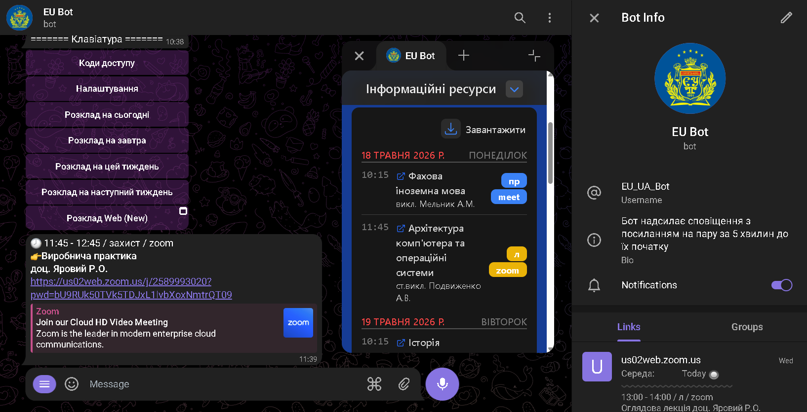
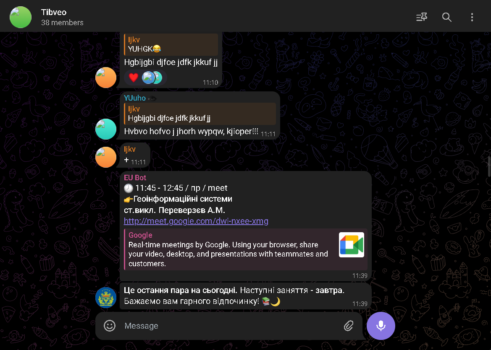
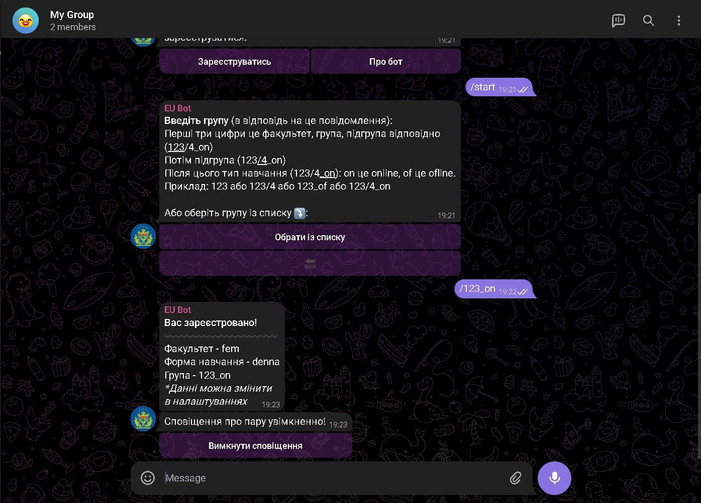
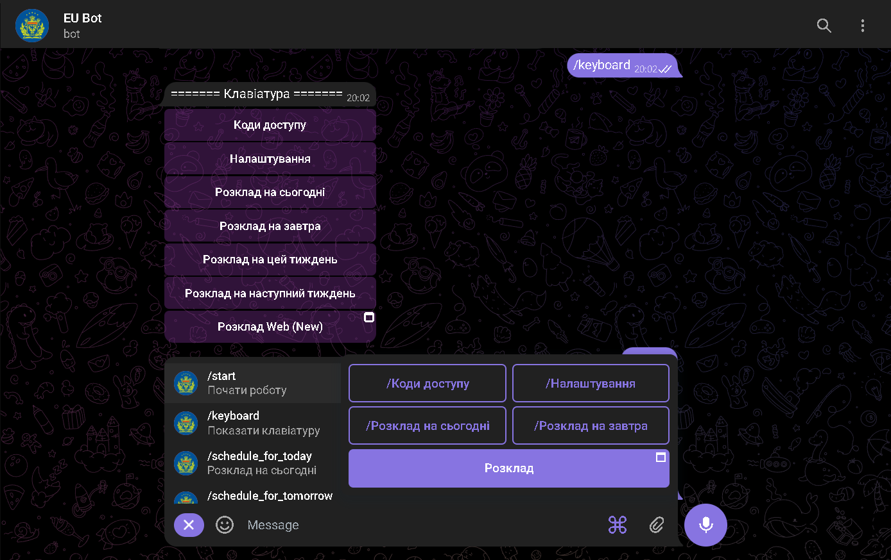
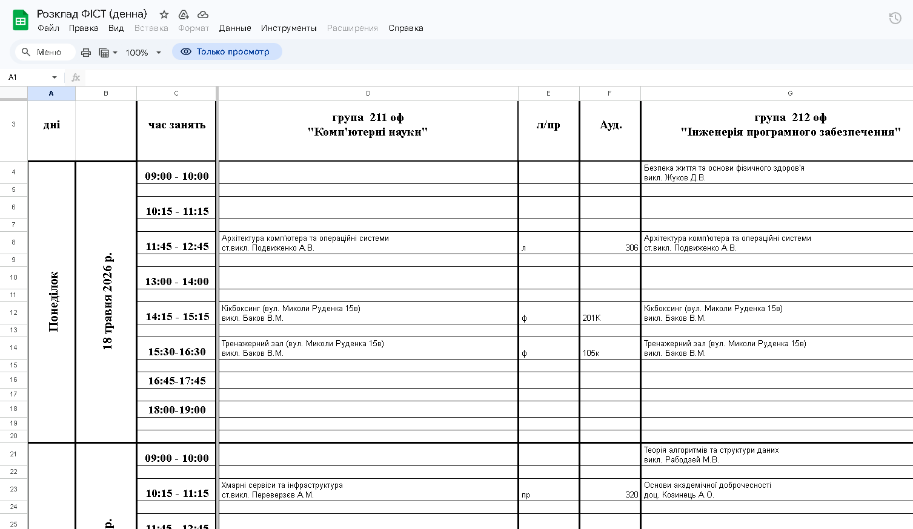
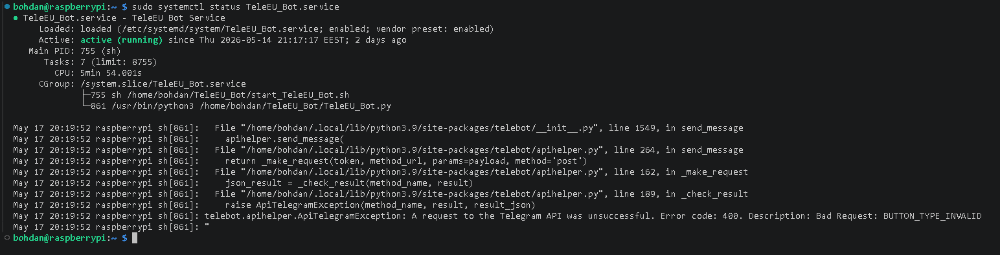

# TeleEU Bot — Telegram Schedule Assistant


**TeleEU Bot** is a Telegram bot that helps students work with university schedules directly from Telegram. It guides users through registration, stores their group settings, parses schedule data from Google Sheets-style sources, and sends automatic Telegram reminders before lessons start.

The project is structured as a production-style Python application with a modular source layout, environment-based configuration, SQLite persistence, background notification processing, tests, helper scripts, and Linux `systemd` deployment support.

---

## Preview

<p align="center">
  
</p>

<table>
  <tr>
    <td width="50%">
      
      <br>
      <sub>Automatic lesson reminder in Telegram</sub>
    </td>
    <td width="50%">
      
      <br>
      <sub>Student registration through Telegram buttons</sub>
    </td>
  </tr>
  <tr>
    <td width="50%">
      
      <br>
      <sub>Bot command menu</sub>
    </td>
    <td width="50%">
      
      <br>
      <sub>Schedule data prepared in a spreadsheet</sub>
    </td>
  </tr>
</table>

---

## What the bot does

- Registers students by education form, faculty, course and group through Telegram buttons.
- Stores user registration and runtime state in SQLite.
- Reads schedule data from local JSON caches and supports updates from external Google Sheets/API sources.
- Parses human-entered spreadsheet data: dates, group names, lesson types, teachers, online links and schedule rows.
- Sends Telegram notifications before lessons according to configured reminder time.
- Shows schedule for today, tomorrow, the current week and upcoming lessons.
- Provides access to online class links when they are available in the parsed data.
- Supports production-like configuration through `.env` without hardcoding secrets in the source code.
- Can run locally on Windows/Linux or continuously on a Linux server as a `systemd` service.

---

## Technology stack

| Area | Used in the project |
|---|---|
| Language | Python 3.11+ |
| Telegram integration | `pyTelegramBotAPI`, Telegram Bot API, inline keyboards, reply keyboards, callback handlers |
| Data source | Google Sheets/API-style sources, JSON schedule caches |
| Data processing | Parsing, normalization, date handling, group matching, lesson type detection, link extraction |
| Storage | SQLite database |
| Configuration | `.env`, `python-dotenv`, typed settings dataclass |
| Runtime | Telegram polling, background notification worker, retry logic, logging |
| Deployment | Windows PowerShell, Linux shell, `systemd` service |
| Quality | Modular package layout, `pytest`, GitHub Actions, `.gitignore`, `.editorconfig` |

---

## How it works

1. The user opens the Telegram bot and starts registration.
2. The bot asks for education form, faculty, course and group.
3. Registration data is saved in SQLite.
4. Schedule data is loaded from local caches or updated from configured external sources.
5. The parser normalizes spreadsheet rows that may contain manually entered values.
6. A background worker checks upcoming lessons and sends reminders before class time.
7. The user can request schedule information and lesson links from Telegram commands or buttons.

---

## Project structure

```text
TeleEU_Bot/
├── data/
│   ├── faculties/              # Faculty configuration cache
│   ├── links/                  # Online class links cache
│   └── schedules/              # Schedule JSON cache files
├── docs/
│   ├── images/                 # README screenshots
│   └── DEPLOYMENT.md           # Additional deployment notes
├── logs/
│   └── .gitkeep                # Runtime logs are ignored by Git
├── scripts/
│   ├── run.sh                  # Linux/macOS helper runner
│   └── run_windows.ps1         # Windows PowerShell helper runner
├── src/
│   └── teleeu_bot/
│       ├── app.py              # Application bootstrap and worker startup
│       ├── config.py           # Environment-based settings
│       ├── database.py         # SQLite access layer
│       ├── keyboards.py        # Telegram keyboard builders
│       ├── logging_config.py   # Console/file logging setup
│       ├── models.py           # Domain data structures
│       ├── handlers/           # Telegram commands and callbacks
│       ├── services/           # Schedule, links and notifications logic
│       └── utils/              # Parsing, date and Telegram helpers
├── systemd/
│   └── teleeu-bot.service.example
├── tests/
│   ├── test_config.py
│   └── test_parsing.py
├── .github/workflows/          # GitHub Actions test workflow
├── .env.example                # Public configuration template
├── .gitignore
├── LICENSE
├── pyproject.toml
├── requirements.txt
└── README.md
```

---

## Requirements

- Python **3.11+**
- Telegram bot token from [@BotFather](https://t.me/BotFather)
- Google API key if remote schedule/link updates are enabled
- Windows 10/11, Linux desktop or Linux server

---

## Configuration

Create a private `.env` file from the example:

```bash
cp .env.example .env
```

Windows PowerShell:

```powershell
Copy-Item .env.example .env
```

Minimum required values:

```env
TELEGRAM_BOT_TOKEN=your_telegram_bot_token
BOT_USERNAME=@your_bot_username
GOOGLE_API_KEY=your_google_api_key
```

The `.env` file contains private tokens and API keys. It must stay local and must not be committed to GitHub.

Main configuration groups:

| Group | Variables |
|---|---|
| Telegram | `TELEGRAM_BOT_TOKEN`, `BOT_USERNAME`, `TEST_TELEGRAM_BOT_TOKEN`, `TEST_BOT_USERNAME` |
| Google/API | `GOOGLE_API_KEY`, `GOOGLE_SHEETS_API_BASE_URL`, `LINKS_SOURCE_URL`, `FACULTIES_SOURCE_URL` |
| Paths | `DATABASE_PATH`, `TEST_DATABASE_PATH`, `DATA_DIR`, `LOGS_DIR` |
| Notifications | `NOTIFY_BEFORE_MINUTES`, `TEST_NOTIFY_BEFORE_MINUTES`, `NOTIFICATION_ATTEMPTS`, `NOTIFICATION_RETRY_WINDOW_MINUTES` |
| Schedule updates | `UPDATE_SCHEDULE_EVERY_DAY`, `UPDATE_LINKS_ENABLED`, `SCHEDULE_ATTEMPTS`, `SCHEDULE_ATTEMPT_PAUSE` |
| Academic logic | `MONTH_OF_COURSE_CHANGE`, `DAY_OF_COURSE_CHANGE` |
| Telegram polling | `POLLING_TIMEOUT`, `POLLING_RESTART_PAUSE` |
| Parsing | `LESSON_TYPE_KEYWORDS` |
| Logging/debug | `LOG_LEVEL`, `DEBUG_CHAT_ID`, `DEBUG_ERROR_THREAD_ID`, `DEBUG_CRITICAL_THREAD_ID` |

See `.env.example` for the full list of supported options.

---

## Run on Windows

Open PowerShell in the project folder:

```powershell
cd C:\Users\<YourUser>\Desktop\TeleEU_Bot
py -3.11 -m venv .venv
.\.venv\Scripts\Activate.ps1
python -m pip install --upgrade pip
python -m pip install -e .
Copy-Item .env.example .env
```

Fill `.env` with real values and start the bot:

```powershell
python -m teleeu_bot
```

Alternative command after editable installation:

```powershell
teleeu-bot
```

Helper script:

```powershell
.\scripts\run_windows.ps1
```

If PowerShell blocks virtual environment activation:

```powershell
Set-ExecutionPolicy -ExecutionPolicy RemoteSigned -Scope CurrentUser
```

---

## Run on Linux

```bash
git clone https://github.com/<your-username>/TeleEU_Bot.git
cd TeleEU_Bot
python3 -m venv .venv
source .venv/bin/activate
python -m pip install --upgrade pip
python -m pip install -e .
cp .env.example .env
nano .env
python -m teleeu_bot
```

Helper script:

```bash
chmod +x scripts/run.sh
./scripts/run.sh
```

---

## Run as a Linux systemd service

A `systemd` service allows the bot to run continuously in the background, restart after failures and start automatically after server reboot.

### 1. Copy the project to `/opt`

```bash
sudo mkdir -p /opt/TeleEU_Bot
sudo cp -r . /opt/TeleEU_Bot
cd /opt/TeleEU_Bot
```

### 2. Create a virtual environment and install the package

```bash
sudo python3 -m venv .venv
sudo .venv/bin/python -m pip install --upgrade pip
sudo .venv/bin/python -m pip install -e .
```

### 3. Create and fill `.env`

```bash
sudo cp .env.example .env
sudo nano .env
```

### 4. Create a service user

```bash
sudo useradd --system --home /opt/TeleEU_Bot --shell /usr/sbin/nologin teleeu || true
sudo chown -R teleeu:teleeu /opt/TeleEU_Bot
```

### 5. Install the service file

```bash
sudo cp systemd/teleeu-bot.service.example /etc/systemd/system/teleeu-bot.service
sudo nano /etc/systemd/system/teleeu-bot.service
```

Check that these values match your server:

```ini
WorkingDirectory=/opt/TeleEU_Bot
EnvironmentFile=/opt/TeleEU_Bot/.env
ExecStart=/opt/TeleEU_Bot/.venv/bin/python -m teleeu_bot
User=teleeu
```

### 6. Enable and start the service

```bash
sudo systemctl daemon-reload
sudo systemctl enable teleeu-bot
sudo systemctl start teleeu-bot
sudo systemctl status teleeu-bot
```

<p align="center">
  
</p>

View live service logs:

```bash
journalctl -u teleeu-bot -f
```

Restart after changing `.env` or code:

```bash
sudo systemctl restart teleeu-bot
```

Stop the service:

```bash
sudo systemctl stop teleeu-bot
```

---

## Bot commands

| Command | Purpose |
|---|---|
| `/start` | Start registration and open the main menu |
| `/Коди доступу` | Open access codes/resources |
| `/Налаштування` | Change user settings |
| `/Розклад на сьогодні` | Show today’s schedule |
| `/Розклад на завтра` | Show tomorrow’s schedule |
| `/Розклад на цей тиждень` | Show weekly schedule |
| `/next_lessons` | Show upcoming lessons |
| `/ping` | Show current bot time |
| `/status` | Show runtime status |

---

## Tests and CI

Install development dependencies:

```bash
python -m pip install -e ".[dev]"
```

Run tests locally:

```bash
pytest
```

Windows PowerShell variant:

```powershell
$env:PYTHONPATH="src"
pytest
```

The repository includes a GitHub Actions workflow in `.github/workflows/tests.yml` for automatic test execution on push and pull requests.

---

## Security checklist before publishing

Before pushing the repository to GitHub:

- keep `.env` local only;
- do not commit Telegram tokens or Google API keys;
- do not commit SQLite databases with real users;
- do not commit runtime logs;
- blur private student data and private lesson links in screenshots;
- check `git status` before every commit;
- use `.env.example` for public configuration documentation.

Useful check:

```bash
git status --short
```

Check whether `.env` is ignored:

```bash
git check-ignore .env
```

Expected output:

```text
.env
```

---

## License

This project is distributed under the MIT License. See `LICENSE` for details.
